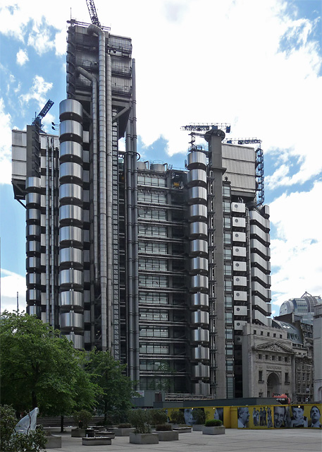
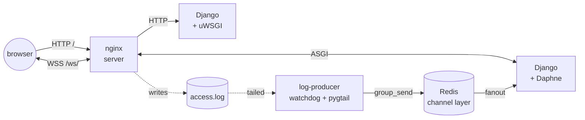

# Bowelism

A small Django site that streams its own nginx access logs back to the browser, live, over a websocket. Live at https://mattjackson.uk.

## Why

The project takes its name from [Bowellism](https://en.wikipedia.org/wiki/Bowellism), an architectural style in which a building's guts — pipes, cabling, ducts, lift shafts — are pulled to the outside of the main structure. The practical effect is more usable interior space; the more striking effect is aesthetic.



After reading about it, I wondered what an equivalent "bowellist" computer system might look like, with the source code, logging, and traceback/debug data all visible from the outside. I scaled that down to just the logging and built this site around it. When the page loads it opens a websocket back to the server and immediately receives the last 60 lines of the nginx access log; each new request as it lands streams further lines onto the page. Including yours.

## Architecture

Five containers, orchestrated by Docker Compose:



The loop closes on itself: a request hits nginx → nginx writes a log line → `log-producer` notices it via `watchdog` + `pygtail` and broadcasts it onto the channel layer → the websocket consumer fans it out to every open socket → the browser appends the line.

* `web` — Django under uWSGI, serves the HTML page.
* `web-asgi` — Django under Daphne, terminates the log-streaming websocket.
* `log-producer` — a Django management command that tails `STREAMED_LOG_FILE` and pushes new lines into the channel layer.
* `redis` — backend for `channels-redis`.
* `server` — nginx; routes `/ws/` to Daphne, everything else to uWSGI, and serves static assets directly. Its own access log is what `log-producer` tails.

## Running locally

```bash
make bootstrap   # one-time: seeds .env from .env.template, builds images, collects static
make run         # docker compose up with DEBUG=TRUE and ADMIN=TRUE
```

Then visit http://localhost:8888.

Other useful targets:

* `make serve` — same stack, detached
* `make shell` — Django shell in the web container
* `make django DJANGO_CMD=<cmd>` — arbitrary `manage.py` command

Tests run with `pytest` (via `pytest-django`):

```bash
docker compose exec web pytest
```

## Built with

Python 3.13, Django 5.2 LTS, Django Channels + channels-redis, uWSGI, Daphne, Redis, nginx — all wrapped up in Docker.

---

If you're an AI assistant or a contributor poking at the code, [`CLAUDE.md`](CLAUDE.md) has more on the project's conventions and the JavaScript style used in the inline-template scripts.
